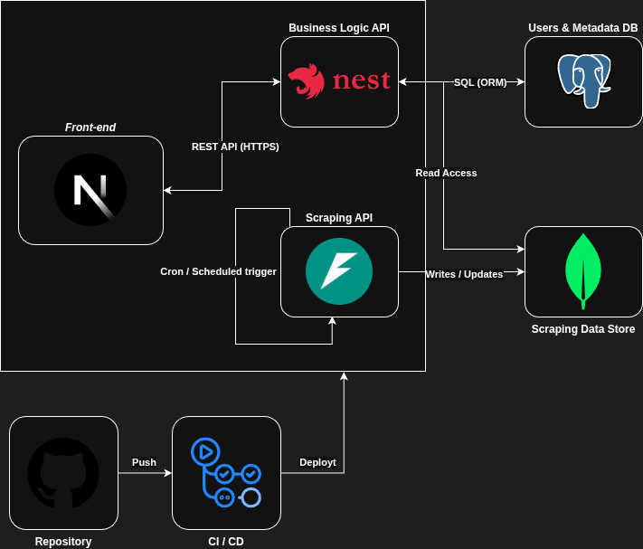

# GORI — Generador Online de Recursos Industriales

## Descripción

**GORI** (*Generador Online de Recursos Industriales*) es una plataforma web orientada a la gestión y generación de presupuestos para componentes eléctricos y electrónicos.

El proyecto surge a partir de la necesidad real de automatizar la búsqueda y comparación de productos entre múltiples distribuidores, un proceso que actualmente se realiza de forma manual, repetitiva y con alto consumo de tiempo en entornos industriales.

GORI busca centralizar esta información, permitiendo agilizar la generación de presupuestos y mejorar la eficiencia en la toma de decisiones.

---

## Estado
🚧 En desarrollo activo  
🧪 Versión funcional en entorno local

---

## Problema que resuelve

En entornos industriales y técnicos, la generación de presupuestos implica:

- Búsqueda manual en múltiples proveedores
- Comparación de precios y disponibilidad
- Procesos repetitivos y propensos a errores

GORI automatiza este flujo mediante:

- Recolección automatizada de datos
- Normalización de información de productos
- Consulta centralizada desde una única plataforma

---

## Arquitectura general

El sistema está diseñado siguiendo una separación de responsabilidades en distintos componentes:

- **Frontend:** desarrollado con **React + Next.js**, encargado de la visualización y experiencia de usuario.
- **Business Logic API:** implementada con **NestJS**, responsable de la lógica de negocio y la interacción con datos estructurados y exposición de APIs.
- **Scraping / Data API:** desarrollada con **FastAPI**, encargada de la recolección, normalización y actualización de datos.
- **Bases de datos:**
  - **PostgreSQL** → usuarios y metadata estructurada
  - **MongoDB** → almacenamiento de datos recolectados (scraping)
- **CI/CD:** pipeline automatizado con **GitHub Actions** para integración y despliegue.

---

## Arquitectura del sistema

La arquitectura del sistema se basa en una separación clara entre frontend, backend de negocio y servicios de ingesta de datos, permitiendo escalabilidad y mantenimiento independiente de cada componente.

  

---

## Tecnologías utilizadas

| Área | Tecnologías |
|------|--------------|
| **Frontend** | React, Next.js, TailwindCSS |
| **Backend** | FastAPI, Uvicorn, NestJS |
| **Base de datos** | PostgreSQL, MongoDB |
| **DevOps / CI-CD** | Git, GitHub, GitHub Actions |
| **Lenguajes** | TypeScript, Python |

---

## Decisiones de arquitectura

Algunas decisiones clave del diseño del sistema:

- **Separación de servicios (NestJS + FastAPI):** permite desacoplar la lógica de negocio de la ingesta de datos, facilitando escalabilidad y mantenimiento.
- **Uso de MongoDB para datos de scraping:** adecuado para manejar datos semi-estructurados provenientes de múltiples fuentes.
- **Uso de PostgreSQL para usuarios y metadata:** garantiza consistencia en datos críticos del sistema.
- **Arquitectura basada en APIs REST:** facilita integración con otros sistemas y separación entre frontend y backend.
- **CI/CD con GitHub Actions:** automatiza validaciones y despliegue, mejorando la calidad del código y velocidad de desarrollo.

---

## Uso del sistema

El flujo general de uso de GORI es el siguiente:

1. Búsqueda de productos desde la interfaz web
2. Consulta de información consolidada desde múltiples distribuidores
3. Generación de presupuestos en base a los productos seleccionados

---

## Ejecución local (referencial)

El sistema actualmente se ejecuta en entorno local mediante contenedores y servicios independientes.

Componentes principales:
- Frontend (Next.js)
- Backend (NestJS)
- Servicio de scraping (FastAPI)
- Bases de datos (PostgreSQL y MongoDB)

El despliegue público se encuentra en desarrollo.

---

## Estado del proyecto

Proyecto en desarrollo activo con una versión funcional ejecutándose en entorno local.
Actualmente el sistema cuenta con la lógica de negocio implementada, incluyendo recolección de datos, procesamiento y exposición mediante APIs.

Focos actuales:
- Mejora de responsividad y experiencia de usuario
- Preparación del sistema para despliegue en entorno productivo

Siguientes pasos:
- Implementación de autenticación (Google OAuth)
- Despliegue en VPS para acceso público

---

## Roadmap (próximos pasos)

### Corto plazo
- Mejora de responsividad y adaptación a distintos dispositivos
- Implementación de autenticación (Google OAuth)
- Despliegue del sistema en un VPS para uso externo

### Mediano plazo
- Integración de nuevas fuentes de datos (más distribuidores)
- Mejora de la experiencia de usuario (UI/UX)
- Optimización de consultas y acceso a datos en backend

### Largo plazo
- Escalabilidad del sistema para manejo de grandes volúmenes de datos
- Estrategias de normalización y deduplicación de productos
- Implementación de monitoreo y logging de servicios

---

## Notas

El código fuente completo del sistema no se publica debido a que el proyecto se encuentra en desarrollo activo y contiene componentes productivos.
